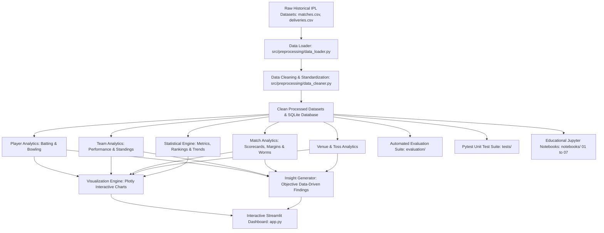

# IPL Performance Analytics Using Data Science and Analytics

<div align="center">

[](https://www.python.org/)
[](https://streamlit.io/)
[](https://plotly.com/)
[](https://opensource.org/licenses/MIT)
[](tests/)
[](.github/workflows/ci.yml)

### 🏏 An End-to-End Sports Analytics Capstone Project for TY B.Sc. Data Science

</div>

---
**Degree Programme**: TY B.Sc. Data Science College Project  
**Core Domain**: Sports Data Science, Statistical Analytics, Interactive Visualization  
**Target Platform**: Python 3.10+ • Streamlit • SQLite • Plotly  

---

## 📖 Executive Summary & Project Abstract

The Indian Premier League (IPL) represents one of the most data-rich, high-variance franchise sports tournaments globally. This project, titled **"IPL Performance Analytics Using Data Science and Analytics"**, develops a modular, robust, and research-oriented data science system that transforms historical ball-by-ball and match-level IPL records into deep analytical insights, transparent performance rankings, head-to-head comparisons, and interactive visualizations.

Rather than treating cricket statistics superficially, this application implements rigorous cricket data science principles:
1. **Separation of Concerns**: Data ingestion, cleaning, player analytics, team analytics, match/venue/toss analytics, statistical calculations, visualization, SQLite storage, insights, and automated evaluations are decoupled into clean Python modules.
2. **Empirical Integrity**: No hard-coded metrics or arbitrary player ratings. Every KPI, average, strike rate, and economy rate is dynamically calculated from ground-truth data.
3. **Scientific Ethics**: Clear adherence to causal boundaries—historical associations (e.g., between toss decisions and match outcomes) are analyzed objectively without presenting correlation as causation. The platform is strictly an educational/analytical tool and avoids speculative or guaranteed match predictions.

---

## 🏗️ System Architecture & Data Workflow



The Data Science lifecycle follows the exact PRD specification:  
**IPL Dataset → Data Collection → Data Preprocessing → Exploratory Data Analysis → Feature Engineering → Statistical Analysis → Player/Team/Match Analysis → Visualization → Dashboard → Insights.**

---

## 📂 Project Directory Structure

The repository adheres strictly to the project specification document (`IPL directory DS.docx`):

```text
IPL-Performance-Analytics/
│
├── app.py                         # Main Streamlit application entry point
├── requirements.txt               # Python package dependencies
├── README.md                      # Comprehensive project documentation
├── .gitignore                     # Git ignore rules
│
├── data/
│   ├── raw/                       # Raw input IPL datasets (matches.csv, deliveries.csv)
│   ├── processed/                 # Standardized, cleaned datasets
│   └── evaluation/                # Validation and benchmark datasets
│
├── database/
│   ├── ipl.db                     # SQLite relational database
│   └── schema.sql                 # SQL schema definitions (teams, players, matches, innings)
│
├── src/
│   ├── preprocessing/
│   │   ├── __init__.py
│   │   ├── data_loader.py         # Dynamic dataset loader and schema detector
│   │   ├── data_cleaner.py        # Team/player standardization and feature engineering
│   │   └── generate_sample_data.py# Multi-season starter dataset generator
│   │
│   ├── player_analysis/
│   │   ├── __init__.py
│   │   ├── batting_analysis.py    # Batting metrics, milestones, and phase splits
│   │   ├── bowling_analysis.py    # Bowling metrics, economies, averages, and hauls
│   │   └── player_comparison.py   # Multi-player comparative benchmarking
│   │
│   ├── team_analysis/
│   │   ├── __init__.py
│   │   ├── team_performance.py    # Win/loss rates, scoring averages, highs/lows
│   │   ├── season_analysis.py     # Season standings, points tables, scoring trends
│   │   └── team_comparison.py     # Head-to-head match-up analytics
│   │
│   ├── match_analysis/
│   │   ├── __init__.py
│   │   ├── match_analysis.py      # Match scorecards, innings progressions, margins
│   │   ├── toss_analysis.py       # Toss decision trends and non-causal associations
│   │   └── venue_analysis.py      # Stadium scoring tendencies and chasing advantages
│   │
│   ├── statistics/
│   │   ├── __init__.py
│   │   ├── performance_metrics.py # Parametric/non-parametric stats & correlations
│   │   ├── rankings.py            # Transparent leaderboard ranking algorithms
│   │   └── trends.py              # Long-term tournament scoring and boundary trends
│   │
│   ├── visualization/
│   │   ├── __init__.py
│   │   ├── player_charts.py       # Batting/bowling bar charts & scatter plots
│   │   ├── team_charts.py         # Win rate horizontal bars & rivalry pies
│   │   ├── match_charts.py        # Over-by-over worm progression & margin histograms
│   │   └── dashboard_charts.py    # Toss donuts, venue bars, and correlation heatmaps
│   │
│   ├── insights/
│   │   ├── __init__.py
│   │   └── insight_generator.py   # Data-driven, non-causal narrative insights
│   │
│   ├── database/
│   │   ├── __init__.py
│   │   ├── db_connection.py       # SQLite connection manager and data loader
│   │   └── queries.py             # Parameterized SQL analytical queries
│   │
│   └── utils/
│       ├── __init__.py
│       └── helpers.py             # Safe division, overs math, IPL team colors
│
├── evaluation/
│   ├── metrics.py                 # Evaluation scoring helper functions
│   ├── evaluate_data_quality.py   # Missingness, duplicate rates, name integrity
│   ├── evaluate_statistics.py     # Ground-truth mathematical validation
│   └── evaluate_dashboard.py      # Pipeline latency and execution integrity
│
├── tests/
│   ├── test_preprocessing.py      # Preprocessing unit tests
│   ├── test_player_analysis.py    # Batting and bowling unit tests
│   ├── test_team_analysis.py      # Team performance and rivalry unit tests
│   ├── test_match_analysis.py    # Match, toss, and venue unit tests
│   ├── test_statistics.py         # Statistical distribution and correlation tests
│   ├── test_visualization.py      # Plotly chart generation unit tests
│   └── test_insights.py           # Insight generation unit tests
│
├── notebooks/
│   ├── 01_data_exploration.ipynb  # Initial EDA on raw data
│   ├── 02_data_preprocessing.ipynb # Cleaning and feature engineering
│   ├── 03_player_analysis.ipynb   # Batting and bowling analysis
│   ├── 04_team_analysis.ipynb     # Team performance and points tables
│   ├── 05_match_analysis.ipynb    # Toss, venue, and margin analysis
│   ├── 06_visualization.ipynb     # Interactive Plotly chart development
│   └── 07_evaluation.ipynb        # Data quality and validation pipeline
│
└── outputs/
    ├── processed_data/             # Cleaned CSV datasets
    ├── player_analysis/            # Exported batting/bowling summaries
    ├── team_analysis/              # Exported team performance summaries
    ├── match_analysis/             # Exported venue summaries
    ├── visualizations/             # Generated charts
    └── evaluation_results/         # Data quality and validation JSON reports
```

---

## 🧮 Mathematical & Statistical Formulations

All analytical calculations in this application follow official cricket scoring rules and mathematical definitions:

### 1. Batting Metrics
- **Batting Average ($BA$)**:
  $$	ext{Batting Average} = rac{	ext{Total Runs Scored}}{	ext{Total Dismissals}}$$
  *(Note: If dismissals $= 0$, the batsman is not out; average equals total runs scored).*
- **Batting Strike Rate ($SR$)**:
  $$	ext{Strike Rate} = \left( rac{	ext{Total Runs Scored}}{	ext{Total Legal Balls Faced}} 
ight) 	imes 100$$
  *(Note: Wides do not count as balls faced by the batsman).*
- **Boundary Percentage ($BP$)**:
  $$	ext{Boundary \%} = \left( rac{(	ext{Fours} 	imes 4) + (	ext{Sixes} 	imes 6)}{	ext{Total Runs}} 
ight) 	imes 100$$
- **Dot Ball Percentage ($DP$)**:
  $$	ext{Dot \%} = \left( rac{	ext{Dot Balls Faced}}{	ext{Total Legal Balls Faced}} 
ight) 	imes 100$$

### 2. Bowling Metrics
- **Overs Notation vs. Decimal Overs**:
  $$	ext{Cricket Overs} = \lfloor 	ext{Balls} / 6 
floor + rac{	ext{Balls} \pmod 6}{10}$$
  $$	ext{Decimal Overs} = rac{	ext{Total Legal Balls}}{6.0}$$
- **Bowling Economy Rate ($Econ$)**:
  $$	ext{Economy} = rac{	ext{Runs Conceded by Bowler}}{	ext{Decimal Overs Bowled}}$$
  *(Note: Byes and leg-byes are fielding extras and are not charged to bowler runs conceded).*
- **Bowling Average ($BwlAvg$)**:
  $$	ext{Bowling Average} = rac{	ext{Runs Conceded}}{	ext{Wickets Taken}}$$
- **Bowling Strike Rate ($BwlSR$)**:
  $$	ext{Bowling Strike Rate} = rac{	ext{Total Legal Balls Bowled}}{	ext{Wickets Taken}}$$

### 3. Team & Tournament Metrics
- **Team Win Percentage ($WP$)**:
  $$	ext{Win \%} = \left( rac{	ext{Matches Won}}{	ext{Total Matches Played}} 
ight) 	imes 100$$
- **Tournament Run Rate ($TRR$)**:
  $$	ext{Tournament Run Rate} = rac{\sum 	ext{Total Tournament Runs}}{\sum 	ext{Total Tournament Decimal Overs}}$$

---

## 🛠️ Technology Stack

| Component | Technology | Version | Purpose |
| :--- | :--- | :--- | :--- |
| **Language** | Python | `3.10+` | Core programming language |
| **Frontend / UI** | Streamlit | `1.30+` | Interactive sports analytics dashboard |
| **Data Processing**| Pandas & NumPy | `2.0+` / `1.24+` | High-performance vectorized data transformations |
| **Statistics** | SciPy | `1.10+` | Parametric/non-parametric tests, skewness, distributions |
| **Visualization**| Plotly Express & Graph Objects | `5.15+` | Publication-ready interactive visualizations |
| **Database** | SQLite & SQLAlchemy | `2.0+` | Zero-configuration local relational database storage |
| **Testing** | Pytest | `7.4+` | Unit testing across all modular analytical components |

---

## ⚡ Installation & Execution Guide

### 1. Clone or Open Project
Ensure your command terminal is located in the project directory:
```bash
cd C:\Users\YASH\.gemini\antigravity\scratch\IPL-Performance-Analytics
```

### 2. Set Up Virtual Environment (Recommended)
```bash
py -m venv venv
venv\Scripts\activate
```

### 3. Install Required Dependencies
```bash
py -m pip install -r requirements.txt
```

### 4. Launch the Streamlit Interactive Dashboard
```bash
streamlit run app.py
```
Upon launching, open your browser at `http://localhost:8501`.

---

## 🧪 Running Automated Tests & Evaluation Suite

### 1. Pytest Unit Tests
Run the comprehensive 7-suite unit test collection:
```bash
py -m pytest tests/ -v
```
All 16 unit tests will execute and validate:
- Preprocessing & name normalization
- Batting and bowling metric calculations
- Team win percentage and head-to-head consistency
- Match scorecards and toss distributions
- Statistical distribution algorithms
- Plotly chart rendering
- Insight narrative generation

### 2. Evaluation Scripts
Execute the evaluation suite to produce automated JSON audit reports:
```bash
# 1. Evaluate dataset quality, missingness, and duplicate rates
py evaluation/evaluate_data_quality.py

# 2. Validate calculated statistics against raw mathematical ground truth
py evaluation/evaluate_statistics.py

# 3. Benchmark dashboard component execution latency
py evaluation/evaluate_dashboard.py
```
Generated reports are automatically saved to `outputs/evaluation_results/`.

---

## 🗄️ Database Integration

The application includes SQLite integration (`database/ipl.db`) with schema defined in `database/schema.sql`.
To re-initialize or migrate data into SQLite programmatically:
```bash
py -c "from src.preprocessing.data_loader import IPLDataLoader; from src.database.db_connection import IPLDatabase; loader = IPLDataLoader(); cm, cd = loader.load_processed_data(); IPLDatabase().populate_from_dataframes(cm, cd)"
```

---

## ⚠️ Limitations & Ethical Considerations

1. **Correlation vs. Causation**: Historical toss associations (e.g. higher chasing win rates in specific seasons) are purely descriptive and must not be interpreted as causal guarantees.
2. **No Guaranteed Predictive Claims**: In adherence to university academic ethics, this project strictly analyzes historical performance. It does not endorse or implement sports betting models or claim guaranteed match forecasting.
3. **Data Completeness**: Certain historical records may contain missing player-of-match entries for abandoned games, or minor variations across venues. The system gracefully accounts for missing data without dropping valid analytical records.

---

## 🚀 Future Enhancements

- Real-time IPL API integration for live match ball-by-ball updates.
- Machine Learning models (Logistic Regression / Random Forest) clearly labeled as *model-based estimates* for in-game win probability curves.
- Ball-trajectory wagon wheels and pitch-map heatmaps.
- Exportable PDF tournament performance reports.

---

**Developed for TY B.Sc. Data Science College Examination & Demonstration.**
